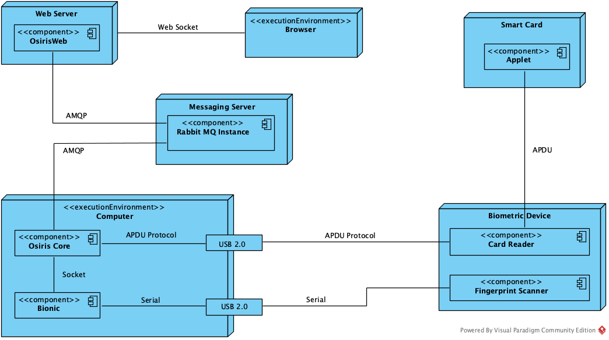
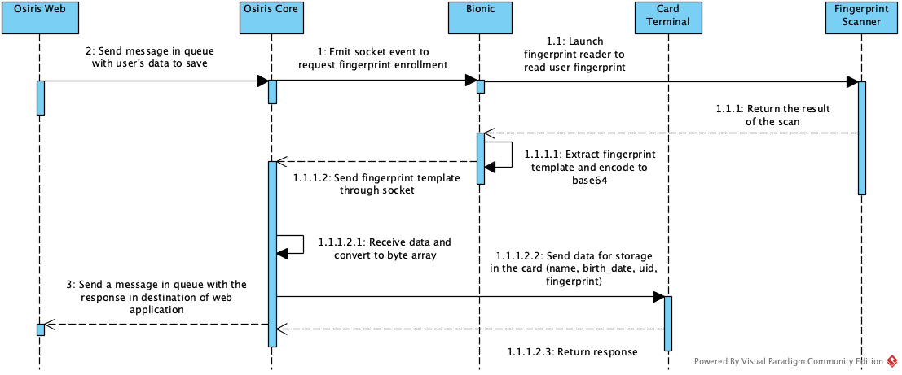
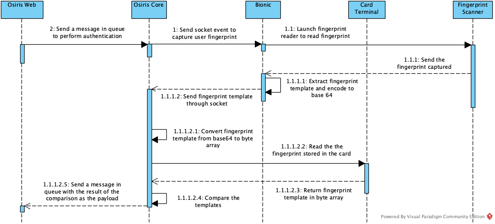
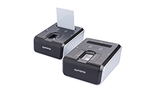
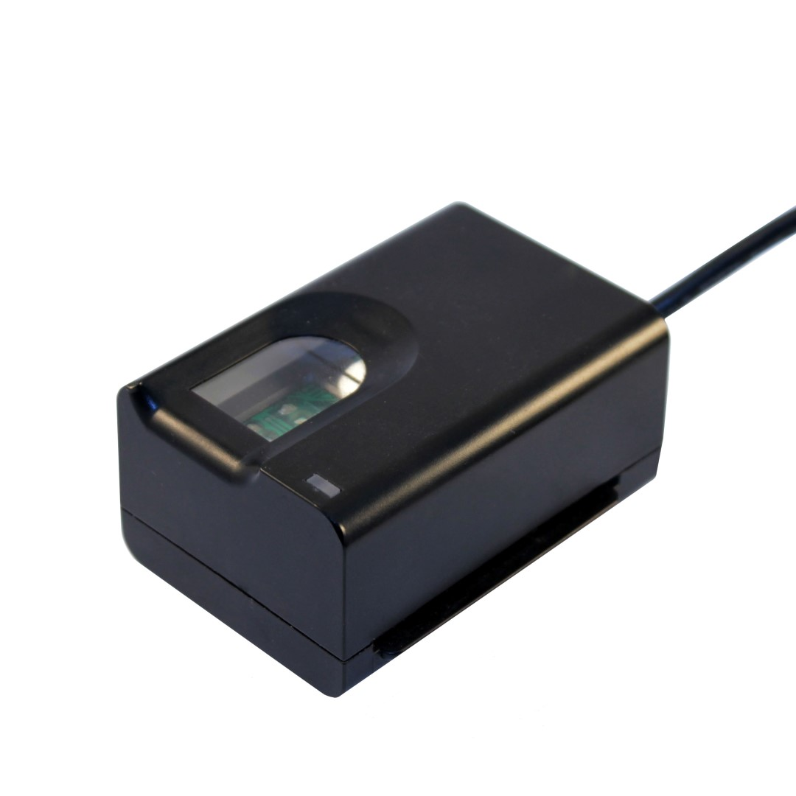

## Data storage in a Smart Card and Fingerprint Authentication

Write personal information of user and his fingerprint in a smart card and allow him to authenticate with the smart card

## Contents
- [Introduction](#introduction)
	- [Why?](#why?)
	- [Why a contest?](#whyacontest?)
	- [Requirements](#requirements)
	- [Achievements](#achievements)
- [Features](#features)
- [Modeling](#modeling)
	- [Deployment Diagram](deploymentdiagram)
	- [Sequence Diagram](sequencediagram)
- [Prerequisites](#prerequisites)
- [Project Folders Description](#projectfoldersdescription)
	- [Required Folders](#requiredfolders)
	- [Others Folders](#othersfolders)
- [Launch](#launch)
- [Demo](#demo)

## Introduction
This a project i made for contest launched by an insurance company in my city.
### Why?
The insurance company has about 10000 clients and many of them subscribed to health assurance. Many customers started complaining about the long time it's for hospital to check if they are elligible for aid. It's consist on fill a form, validate the identity, checks if the user can be received according to the package he subscribed. This process could take 30 minutes or more. Can you imagine if somebody need chirugical operation in the incoming 5 minutes but have to wait 30 minutes to be authenticated, he can die.
That's why the insurance company thought about a solution to fix this problem who was to built numeric solution where the user will be authenticated with a smart card and instantantly get an answer who tell him if he can access to aids.
### Why a contest?
After thought about this solution, their engineers spent 3 months on the process to enroll and authenticate a user with a smart card but got no result. The insurance company was ready to buy a solution abroad (i got this information at the end of the contest) when they think about to launch contest.
We have 7 days to provide a solution and the winner will get prize of 300 Euro and got a job offer to continue work on this project 
### Requirements
* Write the Full Name, Date of Birth and Unique Identifier of an user in the smart card
* Get the fingerprint of the user, extract fingerprint template and store it in the smart card
* Performs user's authentication by matching the fingerprint template stored in the smart card with the one retrieved through the fingerprint scanner
* Give the possibility to reset smart card (clear all data)
* Set PIN a code for the card and request it when we want to performs some actions (write in the card, reset the card)
* Block the smart card after a number of failed attempt (3 by default)
* When a smart card is locked we can read data so authentication with it is not possible
* Allow an admin to unblock a smart card
<br><br>
* Use of Java technology because it's the main stack of the insurance company
* Smart card Scanner, fingerprint scanner and empty smart card was given by insurance company.

### Achievements
Given 7 days to achieve this, i come out with my solution after 6 days by working about 10 hours per day except the week-end where i spent at least 14 hours.
The main projects was:

* **Java applet:** It's the program loaded in a smart card that allow features like write and read data 
* **Web application:** It's provide friendly interface to write and read data from the smart card, stores data in a database and retrieve them for display 

The insurance company really liked my solution and i got job offer but i denied because i'm happy in my company and work on challenging projects wit AI, Blockchain, micro services. Unfortunately they didn't give me the 300 Euro prize. i don't know if it has a link with their job offer i denied.
<br>
I'm really proud of this because<br>

* **I learnt a lot about how Smart Card works and now i have a clear idea on how Credit Card or Personal badge works** 
* **Avoided the company to spend 80 000 euro to buy a solution abroad**
* **During the skills transfer to the engineers of the insurance company, i discover how i was good at explaining things, sharing knowdledge, take example out of the context and the make analogy with our context.** 
* **Sharing the source code will probably someone**

## Features
**Java Applet**

* See **Requirements** sub section in **Introduction** section

**Web Application**

* Register an user and retrieve the list of user registered
* Received notification when a card is inserted or removed
* Launch fingerprint enrollment
* Perform fingerprint authentication
* Display fingerprints pictures

## Modeling
I used UML to design my system and i will the deployment diagram and two mai sequence diagram. I also did use case diagram but i think sequence is more important to understand how a process is implemented.
### Deployment Diagram
This diagram show us how component of our system talk each others so it's a global view of our system

### Sequence Diagram
Two main features are use enrollement and user authentication:

* **Enrollment Sequence Diagram**<br>



* **Authentication Sequence Diagram**<br>



After made this i was able to start coding the applications

## Prerequisites
* Scanners<br>
I used two scanners for test when working on this projects. They have Read/Write capability which means i them to load my applet in the smart card, write data in the memory and also use them to read data stored in the smart card
	1. [Suprema Combo Mini](https://www.suprema-id.com/en/contents/detail.php?code=010105) <br>
	This scanner can read Contact Card, ContactLess Card (NFC), Sim Card and has a fingerprint scanner<br>
	
	2. [Futronic Scanner](https://www.futronic-tech.com/product_fs82hc.html)<br>
	This scanner can read Contact Card and has a fingerprint scanner<br>
	
* Empty Smart Card<br>
I used empty smart card to load my applet program into an test if it's works as expected. A link to know what is a smart card: [Smart card Wikipedia](https://en.wikipedia.org/wiki/Smart_card)<br>
This is a link to buy them: [Buy empty smart card](https://www.smartcardfocus.com/shop/ilp/se~88/gemalto-smartcards/p/index.shtml) <br><br>
There is two important thing to consider when buy a smart card: **Memory size (128Kb, 256Kb and 512Kb)** and **Applet version support (version 2 and version 3)** <br>
Which means, if you write your program with version 3 and load it on a smart card that supports version 2, the loading will fails. <br>
For memory size, the more you have, the more you can store data.<br>
**In my case, smart card has 128Kb of memory and support version 2**
<br><br>
* Development Tools<br>
To be able to develop this solution, this is how your environment should:
	1. Windows operating system: It's required because the drivers for scanner are only available for this operating system
	2. JDK 1.8 or higher
	3. MySQL
	4. RabbitMQ

## Project Folders description
The repository has 10 folders but only 4 are required to make the system works. i will give a description for these folders and also the others 6 seven folder to show in what they are useful.
###Required Folders
1. **Osiris:** It's a java application that use JavaCard technology to write the program that will be loaded in the smart card to handles writing user's data, reading user's data, set PIN code, block and unblock, etc.. 
2. **Osiris Web:** It's a web application built with Spring boot: (Spring MVC, Spring Data, Thymeleaf, Spring Security, Spring RabbitMQ, Spring Websocket). It provides an user friendly interfaces to write data in the smart card, display data coming from the read and receive notification when a card is inserted or removed.
3. **Osiris Core:** It's a java application that acts as an interface between the Java applet and the Web application who allow them to communicate each others. 
	* 	It connect to the smart card and when successful, a listener starts to listen when a card is inserted or removed. 
	*  It also contains the code to capture user's fingerprint and extract the teemplates
	*  It receives message coming from RabbitMQ and parse the payload to identify the action to do performs in the smart card (write, read, block, reset, etc..), format the message (APDU Command) and send it in the Applet previously loaded in the smart card.

	**Use case:** Write data in the smart card<br>
When user fill the inputs (Name and Date of birth) and click on the button "Register", the client send a socket event to the server, the server receive the message and send in the message queue. Osiris core consume the message in the queue, format the message and send APDU command to the Applet, the Applet write data in the smart card memory and send a response to Osiris Core who post the message in queue and the server consume, parse the payload and send socket event to the client. 
4.	**Bionic:** This application is only required if you use Futronic Scanner. The SDK for fingerprint capture is written in C# so i have to create another project to make the complete flow work.

###Others Folders
1. **OsirisV3:** I previously said that my smart card support Applet written in version 2 (JavaCard 2) but i didn't noticed it at the beginning. Indeed, i started writing the Applet with JavaCard 3 and it's at the moment to load it in the smart that sees noticed after seeing all my attempts failed. The other reason is the fact that it's was mor easier to debug with V3 (using Netbeans IDE) rather than V2 (Using Eclipse Luna). So this application is the same Applet but for Version 3.
2. **Osiris Client:** It's a APDU client i wrote to test if my applet handle command as expected. You can see it like a simulator. It avoids me to generate the installer, load in the scmart card, insert in the card reader, and test. If it's no okay, i fix and do the same process. So, this projects if helpful only in development (When writing you applet)
3. **SmartCard Client:** It's a APDU client but for JavaCard 3
4. **Fingerprint:** I created this project to make fingeprint implementation more easier. The code sample provided by SDK was almost 3000 lines written in procedural way. so i went through it, understand the code and extract useful methods and create a class for that (i like OOP).<br> Other point with code sample, i was not able to perform two successives fingerprint scan bacause the variable was unintialized at the end; for example, if user authentication failed, he can't retry because app will throw NullPointerException. To perform another scan, you need to reinitialize the scanner (Take 15 - 30 seconds). When rewrite it with OOP way, i solve this using Singleton Pattern and provide a method to uninitialize the scanner when we don't need. <br> This now i performs fingerprint capture:

```
// Initialize the scanner
FingerPrint fp = new FingerPrint("<folder_to_save_picture>", "<name_of_the_file>");

// Get scanners list
List<FingerprintScanner> scanners = fp.getScanners();

// Select the first scanner
fp.setParameters(0);

// Start fingerprint capture
fp.captureSingle();

// Extract the fingerprint and save the template in a file or not
boolean en = fp.enroll(false);

// Save the images of the fingerprint [Optional]
fp.saveImage()

// Get the template extracted after the capture
byte[] template = fp.getCurrentTemplate();

// TODO Store the template in the smart card memory
```
Doing this with code sample, will take about 200 lines a couldn't be reused.<br><br>
5.	**Build:** This folder contains the tools i use to install/uninstall the compiled applet in the smart card. I use [Global Platform Pro](https://github.com/martinpaljak/GlobalPlatformPro). I put in a file some useful command i used.<br><br>
6. **Tools:** This folder contains useful software while implementing this solution: **Suprema Driver, Futronic Driver, JavaCard Kit 2.2.2, Java Card Development Kit for Eclipse (JCDE)**.<br>
There is also a folder with some documents on JavaCard Technology that helped me.

##Launch
To run the project, make sure RabbitMQ is running then:

1.	Start Osiris web (from your IDE or mvn spring:boot run)
2.	Plug Card Reader and Fingerprint Scanner
3. Start Osiris Core (from your IDE)
4. Insert the the smart card in the card reader
5. Play

**Note:** If you're using Futronic driver, you need to Start Bionic project using Visual studio 2015

##Demo
I hosted a demo on Youtube at this [link](https://www.youtube.com/watch?v=QcHWxv8MELw)
